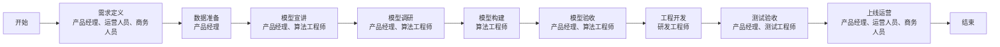

# **AI产品经理能力必备**


## AI大模型发展趋势
### 行业洞察
**BBAT玩家**
- 百度: 文心大模型
- 阿里巴巴: 通义千问
- 腾讯: 混元大模型
- 抖音: 豆包大模型
  
**四小龙**
- 智普AI: GML-4
- Moonshot AI 月之暗影 : Kimi
- 百川智能: Biachuan 4
- MiniMax: abab 6.5

**AI关键技术发展**
- OpenAI全家桶
- "地表最强" Claude 3.7 -> Claude  Sonnet
- Google Gemini
- Deepseek 和 阿里推理模型QwQ-32B(开源)

**从ChatGPT到Agent3.0**

对话式AI -> 流程固化Agent -> 通用Agent
- Agent1.0: 与大模型交互问答, 直接展示**说话**, 例如ChatGPT
- Agent2.0: 人工搭建业务工作流,直接展示**过程**, 例如Dify/Coze
- Agent3.0: 大模型自动规划工作流, 直接展示**结果**, 例如Manus

**行业应用**


| 行业   | 场景1                          | 场景2                          | 场景3                          |
| ------ | ------------------------------ | ------------------------------ | ------------------------------ |
| **工业** | 设计优化<br> - 汽车算法设计<br> - 增材设计AI内化<br> - 产线布局规划<br> - 3D仿真 | 3D模型<br> - 工业部件无损真实3D呈现<br> - 钢铁缺陷检测模型<br> - PPT数字孪生生成<br> - 调研题型Excel表格建模 | 制造检测<br> - 智能安防·工业检测<br> - 企业与人协作场景<br> - 智能物流流程 |
| **医疗** | 药物发现<br> - 蛋白结构预测<br> - 药物分子发现<br> - 抗体人用化预测 | 诊断治疗<br> - 辅助诊断生成<br> - 影像标注流程<br> - 合成数据模型搭建<br> - 3D治疗方案生成 | 关怀陪伴<br> - AI陪护服务<br> - 交互式心理咨询<br> - 个性健康方案规划 |
| **金融** | 数字员工<br> - AI客服接待<br> - 风险投资顾问<br> - 数字营业厅功能 | 投资管理<br> - 市场数据分析<br> - 投资组合决策<br> - 个人财务数据分析<br> - 信用评分体系 | 风险管理<br> - 绘图欺诈识别<br> - 风险报告生成 |
| **教育** | 课程生成<br> - 教材编写<br> - 错题视频生成<br> - 虚拟教师应用<br> - 课件/笔记自动生成 | 智能助教<br> - 智能作业批改<br> - 学情分析<br> - 学习薄弱点反馈<br> - 精准复习定制 | 口语老师<br> - 口语对话练习<br> - 口语测评 |
| **电商** | 商品展示<br> - 3D模型生成<br> - 智能商品详情<br> - 营销内容生成<br> - 商品分类查找 | 主播打造<br> - 虚拟主播搭建<br> - 虚拟直播与换装<br> - 品牌营销决策支持 | 交易场景<br> - 虚拟商城搭建<br> - 虚拟客服服务<br> - 品牌营销关联 |
| **传媒** | 新闻采集<br> - 采访音频识别<br> - 新闻事件舆情分析<br> - 音频转写处理<br> - 交互式直播 | 新闻编辑<br> - 写稿机器人应用<br> - 快速剪辑视频制作<br> - 改写/降重/翻译/摘要<br> - 格式转化与海报制作 | 新闻播报<br> - AI新闻主播<br> - AI晚会主持 |
| **影视** | 剧本创作<br> - AI剧本写作<br> - 大纲创作<br> - 角色小传设计<br> - 场景对话生成 | 视频拍摄<br> - 高难度动作合成<br> - 虚拟已故名演员还原<br> - AI数字人片拍摄<br> - 声音合成 | 后期制作<br> - 影像修复<br> - 老片上色<br> - AI换脸<br> - 年龄/表情修复 |
| **娱乐** | 全民娱乐<br> - 人脸美妆<br> - 换装/换脸<br> - 音乐伴奏适配<br> - AI短视频分析<br> - 人体检测美化 | 偶像养成<br> - 虚拟偶像打造<br> - 现实明星虚拟分身<br> - 已故名明星重现<br> - 虚拟演唱会/元宇宙演出 | 社交互动<br> - AI生成用户数字分身<br> - 定制AI伙伴 |
| **游戏** | 游戏研发<br> - 原画设计及生成<br> - 角色模型生成<br> - 角色设计<br> - 游戏平衡性测试辅助 | 玩法创新<br> - 个性化关卡定制<br> - NPC交互设计<br> - AI游戏教学<br> - 队友匹配/玩家托管 | 催生品类<br> - 实时内容生成类<br> - AI音乐创作类<br> - 玩家自定义音乐 | 

### 热门AI产品
**1. 大模型应用**
- ChatGPT, OpenAI研发的一款聊天机器人程序
- Claude, Anthropic 发布的大型语言模型家族,对标ChatGPT
- Gemini, Google发布的模型,能处理多种类型信息
- 豆包, 字节的AI工具
- Kimi, 支持超长文本的上下文处理
- DeepSeek, 新一代开源模型最强王者
- 通义千问, 阿里云研发的超大规模语言模型
- 文心一言, 百度知识增强大模型
- 腾讯元宝, 结合了DeepSeek

**2. 图片类应用**
- DALL·E3, OpenAI研发的开源**文生图**模型
- Midjourney, 一款StaAI绘图工具,让创作变得简单有趣
- Stable Diffusion3.5,  强大的AI绘画生成工具
- Canva AI, 在线设计工具Canva推出的AI图像生成工具
- 文心一格, 百度推出的AI艺术和创意辅助平台
- Imagen 3, Google最先进的图像生成工具

**3. 视频类应用**
- Suno, 将文本转为话个性化的音乐作品
- 讯飞听见, 科大讯飞推出的现在AI语音转文字工具
- Eleven Labs, 可创建不同语言, 口音和情感的合成语音
- TME Studio, 腾讯音乐推出的智能音乐创作大模型
- 魔音工坊, 一款媲美真人的AI配音软件
  
**4. 音频类应用**
- Suno， 将文本转为为个性化的音乐作品
- Eleven Labs, 可创作不同语言、口音和情感的合成语音
- TME Studio, 腾讯音乐推出的智能音乐创作大模型
- 魔音工坊， 一款媲美真人的AI配音软件
- 讯飞听见， 科大讯飞推出的在线AI语音转文字工具

**5. 搜索类应用**
- Perplexity, 一款创新的对话式搜索引擎，一键直达结果
- Bing, 由微软推出
- 天工AI搜索， 知识从这里开始
- 知乎直答
- 秘塔搜索
- 问问小宇宙，播客检索服务
- 海螺AI, MiniMax推出的免费AI智能聊天助手

**6. 泛办公工具类应用**
- WPS AI, WPS旗下推出的智能办公助手
- 百度文库AI助手， 一站式AI内容获取和创作平台
- 蛙蛙写作， AI小说和内容创作助手
- NOtion AI， 让你想的更广、做得更快，强化你的创造
- Figma AI, Figma推出的AI创作工具, 可以根据用户需求生成设计稿
- AiPPT,
- ChatExcel, 结合自然语言进行数据处理
  
**7. 其他**
- GitHub Copilot, AI编程工具
- Dify AI, 生成式AI应用创新引擎
- Coze, 字节推出的AI开发平台
- Cursor, 零基础利用自然语言编程
- 腾讯元器， 智能体开放平台


##

## AI产品设计方法论
### AI时代下产品设计考虑哪些点
-  用户， 重新理解产品设计对象，如产品轻量化、人群细分化等
-  产品， AI场景下的设计原则
-  体验， 基于AI能力深化用户体验， 如个性化、情感化和无障碍设计
-  创新， Ai思维驱动的创新框架，例如服务体验创新，场景拓展和框架重构等


### AI场景下产品设计五大原则
- 第一性原理: 从用户的真实需求出发, 制定最小化满足的产品方案
- 易用性原理: 拒绝利用AI炫技,只在关键场景应用AI能力
- 安全性原理: AI数据安全, 覆盖技术安全,设计方案,应用管理多个层面
- 低成本原理: AI产品背后的成本测算,包括大模型,算力,数据成本等
- 可持续发展: 对产品和资源进行AI智能化监测, 提高利用效率,为可持续发展提供新的解决方案
  
### AI价值评估体系 RLNP
- **ROI （Return On Investment）投资回报率**
  
  作用：价值评估 

  用于衡量AI技术投入与产出的关系，其核心在于量化技术对**效率提升**、**创新加速**等非财务指标的影响。AI的ROI不仅直接关注成本节省，更强调**生产力跃迁**和**创新周期缩短**等长期价值。

  **核心公式**

  **ROI = (AI技术创造的增量价值 - 全周期成本) / 全周期成本**

    >  **例子**
    > 
    > 假设某电商平台实施了AI推荐系统，计算其ROI.
    > 
    > **增量价值**
    > 
    > - 转化率提升： 推荐系统上线后，平台GMV(Gross Merchandise Volume)从每月1000万增加到1200万，增量价值为200万/月
    >
    > - 按年计算：年增量价值 = 200万 x 12 = 2400 万元
    >
    > - 数据成本：用户行为数据采集与清洗 = 100 万元
    >
    > - 模型成本：算法团队研发投入 + 训练算力成本 = 300万元 + 50万元 = 350 万元
    >
    > - 维护成本：系统运维 + 模型迭代与优化 = 120万元 + 180万元 = 300 万元/年
    > 
    > - 总成本 = 100 万元 + 350 万元 + 300 万元 = 750 万元
    >
    > - ROI计算： ROI = (2400 万元 - 750 万元) / 750 万元 x 100% = 220%
    > 
    > **电商平台在AI推荐系统上每一元投入，能带来2.2元的回报。**
    > 
- **LTV （Life Time Value） 用户生命周期价值**
  
  作用：生命周期价值分析

  衡量用户从获客到流失的全周期贡献，需要结合AI预测能力优化用户分层与运营策略。

  **核心公式**

  **LTV = ARPU * LT = （总收入 / 总用户数） *  1 /（1 - 留存率）**

  ARPU(用户平均收入)受付费频率与客单价影响, LT通过留存率拟合,常用幂函数模型预测(如次日留存率决定LT).

    >**AI结合用户生命周期价值分析LTV**
    >
    > **1. 预测模型**
    > 
    > - 传统模型：基于历史留存率的回归分析（R**2 > 0.8 时有效）
    > 
    > - 机器学习：XGBoost多分类模型可提升预测精度（测试集准确度达84%），神经网络在长期用户预测中优于统计模型
    >
    > - 动态调整: 结合用户行为数据(如RFM模型, 最近消费Recency, 消费频率Frequency, 消费金额Montetary)实时更新LTV预测
    > 
    > **2. 应用场景**
    > - 订阅制产品: 通过续费率优化LTV计算(如首次续费率50%时调整获客策略)
    >
    > - 游戏行业: 细分用户群体(如高付费玩家)以定制差异化的活动策略


- **NPS （Net Promoter Score） 净值推荐**
    
  作用：产品满意度反馈

  通过0-10分量化用户推荐意愿，AI技术可提升数据采集和分析效率。
  
  **数据采集**
  自动化触发调查(如客户完成交易后实时推送), 多渠道整合(社交媒体,在线评论).
  **分类标准**
  - 推荐者(9-10分):需要通过忠诚计划强化其口碑效应. 
  - 被动者(7-8分): 通过个性化推送提高活跃度.                   
  - 批评者(0-6分): NLP情感分析识别负面关键词(如"延迟","故障"), 触发人工干预.


    > **AI结合用户满意度反馈NPS**
    >
    > **1. 自然语言处理**
    >
    > - 情感分析: 识别反馈中的情绪极性(积极/消极)
    >
    > - 主题建模: 提取高频问题(如"客服响应慢")
    >
    >**2. 实时仪表盘**
    >
    > - 可视化NPS趋势(展示不同维度的NPS数据)
    > - 细分维度(如地区\产品版本)


- **PMF （Product Market Fit） 产品市场匹配度**

  作用：业务场景商业化平衡

  验证AI解决方案是否满足市场需求，作为产品可否商业化的重要考量, 评估从三个维度展开
  - 价值创造: 需求匹配度(如"失望指数"衡量用户需求未满足比例)
  - 价值传递: 用户激活率与留存率(如30日留存>40%为PMF达标)
  - 价值货币化: 单位经济模型健康(如LTV/CAC > 3)
  
    > **三大评估维度**
    >
    >1.价值创造
    >
    > - 需求匹配度:通过功能渗透率等指标衡量用户需求满足比例
    > - 反应AI解决方案与实际市场需求的契合程度
    >
    >2.价值传递
    > - 用户激活率与留存率如30日留存>40%为PMF达标(视业务而定)
    > - 衡量用户对AI解决方案的接受度和持续使用意愿
    >3.价值货币化
    > - LVT, CAC, ROI
    > - 评估AI解决方案的商业可持续性
  
### AI产品需求挖掘及分析
#### **用户需求从哪里来**
- **一问 用户是谁？**
  
  1. 大B: 通常时企业、机构等大型客户，采购量大，需求复杂但迭代少；产品资源有限，谁有钱为谁服务。
  2. 大C: 相对大B客户规模较小，但仍然具有一定消费能力的群体；产品只重点服务一群能消费的人群。
  3. 小C：更加聚焦于特定细分领域或者小众市场的消费者；哪些人群能消费，产品服务谁。
  4. 小小C:非常细分、个性化的消费群体，且同个细分领域出现多个产品竞争；产品服务谁，就培养哪些人群消费。

- **二问 场景在哪？**
  1. 物理：地点（家庭/户外）、设备（手机/智能音箱）、网络、环境（4G/Wi-Fi）
  2. 行为: 触发动作（如收到通知后打开App）、任务流程（如购物中的比价-下单-支付）
  3. 情感：用户情绪状态（焦虑、愉悦），对行为的影响（如焦虑时更容易冲动消费）
   
- **三问 问题是啥？**
  
#### **用户需求到哪里去**
- 四问 我能做啥优化？
- 五问 这么多的收益？
- 六问 这么多的成本？

#### **需求挖掘工具“用户旅程地图” + AI**
- 人物：确定客户旅程的主人公，TA的年龄、身份、收入、喜好...... 
- 阶段：梳理客户旅程中的阶段，例如售前、售中、售后、线上、线下......
- 期望：了解客户的期望，比如客户对产品、服务、企业有哪些期待......
- 场景：还原客户旅程中的场景，客户所处的环境、时间、遇到了哪些事情......
- 触点：找到客户旅程中的触电，与客户发生交互的点，如网站、店铺、客服......
- 情绪：感知客户的情绪，比如某个场景下客户是开心、愤怒、无奈、冷漠......
- 痛点：定位客户旅程中的痛点，比如产品本身、服务流程中存在的问题......
- 机会：挖掘优化客户旅程机会点，如何才能让体验更好，客户更满意......
  

**案例一：某冻品冷链公司**

**1. 确定关键用户角色**
- 冻品生产商/供应商
- 批发商/分销商
- 零售商（超市、餐厅等）
-  物流运输方
-  仓储管理员
-  终端用户（如餐饮采购人员）
  
**2. 识别关键阶段**
- 产品发现与选择
- 价格询问与谈判
- 下单与支付
- 仓储与库存管理
- 物流与运输
- 收货与验收
- 售后服务与反馈
  
**3. 每个阶段的用户体验考量**

如产品发现与选择：
- 清晰的产品目录与分类
- 详细的产品信息（产地、包装规格、保质期等）
- 产品库存实时状态
- 推荐系统（基于季节性需求、历史购买记录等）


|    | 产品发现与选择  | 价格询问与谈判 | 下单与支付  | 仓储与库存管理 | 物流与运输 | 收货与验收| 售后服务与反馈 |
| ------ | ----- | ----- | ---- | ------ | ----- | ---- | ----|
| **用户行为** |  - 浏览产品目录<br> - 查询产品信息<br> - 比较不同供应商<br> | - 查看价格表<br> - 提交询价单<br> - 协商价格条款| - 生产订单<br> - 确认订单细节<br> - 完成支付流程 | - 查看库存状态<br> - 监控商品温度<br> - 跟踪批次信息 | 查看运输路线<br> - 监控车辆位置<br> - 接收送达提醒 | - 验证送达商品<br> -检查温度记录<br> -确认收货质量 | - 提交反馈意见<br> - 处理退换货<br> - 参与满意度调查|
| **体验触点** |  - 产品目录系统<br> - 季节性推荐<br> - 产品详情页<br> | - 线上报价系统<br> - 批量折扣计算器<br> - 在线对话平台| - 订单表单系统<br> - 多支付渠道<br> - 电子合同系统 | - 库存管理界面<br> - 温度监控图表<br> - 批次追踪系统 | GPS追踪系统<br> - 温度检测APP<br> - 短信/推送通知 | - 移动验收工具<br> -电子签收系统<br> - 质检报告生成 | - 客服聊天系统<br> - 退换货处理平台<br> - 评价反馈系统|
| **情感曲线（满意、中性、不满）** |  --- | /| --- | \ |--- |--- |/ |
| **机会点** |  AI产品推荐系统 | 自动报价工具| 一键式下单体验 | 区块链溯源系统 |智能化路线优化 |自动化质检系统 |数据驱动的持续改进 |
| **AI优化方案 1** |  智能推荐系统（个性化季节性推荐） | 动态定价算法（实时市场供需调价）| 智能合同生成（自动生成交易合同） | 预测性库存管理（避免过度库存或缺货）|智能路径规划（多因素优化配送路线） |AI质检系统（计算机视觉检测质量）|智能客服（处理常见问题和投诉） |
| **AI优化方案 2** |  需求预测（基于历史数据预测需求） | AI谈判助手（提供最佳成交价建议）| 欺诈检测系统（识别异常交易模式） | 智能温控系统（优化能源使用效率） |环境自适应控制（自动调整车内制冷参数） |数字孪生技术（比对预测与实际状态） |情感分析（识别满意度问题）|


**案例二：某车险经销商公司**

**1. 确定关键用户角色**
- 个人车主
- 企业车队管理员
- 汽车经销商
- 维修厂合作伙伴
- 保险公司合作伙伴
- 二手车商

**2. 识别关键阶段**
- 保险需求认知
- 产品比较与价格选择
- 报价获取与核保
- 支付与承保
- 保单管理
- 理赔服务
- 收货与验收
- 续保与口碑传播

**3. 每个阶段的用户体验考量**

如产品比较与选择价格
- 价格构成可视化拆解
- AI险种匹配引擎
- 一键获取多保司最优组合
- 个性化议价助手
- 隐性成本预警系统


|    | 保险需求认知  | 保险信息查询 | 方案比较选择  | 购买与支付 | 保单管理 | 理赔服务| 续保与反馈 |
| ------ | ----- | ----- | ---- | ------ | ----- | ---- | ----|
| **用户行为** |  - 认识车险必要性<br> - 了解车险类型<br> - 确当保障需求<br> -寻找专业顾问 | - 查看保险产品<br> - 咨询价格明细<br> - 了解保障范围<br> - 提交车辆信息| -对比多家报价<br> - 分析保障差异<br> - 咨询专业意见<br> -确定投保方案 | - 确认保单信息<br> - 提交投保资料<br> - 选择支付方式<br> - 完成支付流程| -获取电子保单<br> - 查询保险状态<br> - 了解保单变更<br> - 保存重要信息 | - 事故报案<br> -提交理赔材料<br> -跟踪理赔进度<br> -确认理赔结果 | - 接受续保提醒<br> - 评估保险体验<br> - 提交服务反馈<br> -考虑调整方案|
| **系统支持** |  - 车险知识库<br> - 需求评估系统<br> - 保险顾问匹配<br> | - 车险产品记录<br> - 价格计算器<br> - 在线咨询平台| - 多方案比较器<br> - 保障分析工具<br> - 推荐引擎系统 | - 投保流程系统<br> - 资料验证平台<br> - 多渠道支付系统 | 保单管理平台<br> - 状态查询系统<br> - 变更申请工具 | - 理赔报案系统<br> -材料上传工具<br> - 进度跟踪平台 | - 续保提醒服务<br> - 客户反馈平台<br> - 方案优化工具|
| **情感曲线（满意、中性、不满）** |  --- | /| --- | \ |--- |--- |/ |
| **机会与改进** |  智能需求分析/ 使用场景推荐 | AI价格比对工具 / 透明价格说明 | 个性化推荐系统 / 决策辅助系统 | 一键投保体验/简化支付流程 |区块链保单系统 / 主动服务系统|智能理赔评估/无纸化理赔 |数据驱动的持续改进/个性化续保方案 |
| **AI优化方案** |  -智能风险评估<br> -用户画像分析<br> -场景式推荐 | -NLP问答系统<br> -实时价格预测<br> -多维比价可视化| -智能方案匹配<br> -协同过滤推荐<br> -辅助选择 | -OCR资料识别<br> -智能核保系统<br> -欺诈风险预警 | -智能合约保单<br> -异常风险提醒<br> -主动服务预测 |-AI损伤评估<br> -图像识别理赔<br> -理赔欺诈检测| -智能推荐续保<br> -情感分析反馈<br> -客户流失预警 |

### LLM选型策略及成本测算
**1. 自研模型 vs 第三方API成本对比**
   
|对比维度|自研LLM方案|第三方API方案|
| ---- | ---- | ---- |
|**成本结构**|前期固定成本：硬件（A100 GPU集群）约12 - 16万<br> 人力成本：团队（10 - 15人）年均180 - 270万<br> 运营成本：电费等年约1050万，维护费高<br> 隐性成本：技术风险20 - 30%，机会成本高<br>总结：高前期投入，固定成本占比大|调用单价：GPT - 4 Turbo每百万tokens约10/30元<br>免费额度：首年满额有一定免费调用<br>供应商锁定：业务逻辑适配成本高<br>安全合规：审计费用约5 - 20万/年<br>总结：零前期投入，按量付费更灵活|
|**吞吐量与规划**|单机性能：H100 GPU约3000 tokens/sec<br>扩展能力：集群扩展效率约70 - 85%<br>资源冗余：需预留20 - 30%应对峰值流量<br>总结：10台H100集群可处理约25,500 tokens/sec|弹性能力：分钟级扩容，可支持千倍流量<br>资源利用：共享资源池，利用率≈90%<br>峰值处理：无需预留资源，真正按需付费<br>总结：AWS Auto Scaling可在1分钟内扩展千倍容量|
|**扩展性与合规性**|扩容周期长，边际成本递增40 - 60%<br>数据隔离需物理隔离GPU，成本增30%|数据出境风险，需额外部署敏感数据层（1 - 5万/月）<br>连带责任风险，需专项保险（约10万/年）| 

**2. 2C&2B产品的模型成本**
- 2C场景：更注重个性哈服务、用户体验优化和多模态集成， 特点包括高效性、灵活性和低成本
- 2B场景： 更注重企业效率提升、复杂任务支持和私有化知识整合， 需要考虑合规性、数据安全和行业特性需求
- 成本影响因素： 模型大小、调用频率、响应时效、资源消耗、定价策略、合规性要求和数据隐私成本扽分多方面因素共同影响最终成本
  

**3. C端成本公式**

- 总成本 = Token量 x (输入单价 + 输出单价) + 合规性分摊成本总成本
- 优化方向： 采用混合模型（如免费用户用开源模型， 付费用户用付费模型）

**4. B端成本公式**
- 总成本 = 私有化部署硬件 + 微调费用 + RAG知识库维护 + 合规审计总成本
- 优化方向： 采购长期订阅套餐（如Azure企业协议）降低Token单价


**5. AI模型效果评估**

如何更好的评估模型？

1.  简单粗暴”刷榜“： 各种测评榜单
2.  真实的体验评测： 场景实测、多模型横向对比
3.  多维评估： 评估思考力模型（实测）、 评估行动力模型（评估函数调用的准确性）
   
一些榜单例子：
- 中文的通用大模型榜单 SuperCLUE
  - 理科: 计算（线性代数、概率统计等）、 逻辑推理（三段论、关系推理、朴素推理等）、代码
  - 文科：知识百科、语言理解（信息抽取、意图识别、情感分析、摘要等）、长文本（全文摘要、线索摘要、多文本创作等）、角色扮演、生成与创作、安全（犯罪、财产隐私、偏见歧视、道德伦理、脏话侮辱等）、工具使用（检索调用、规划API通用工具使用等）
  - Hard：精确指令遵循、复杂任务多步推理、高难度问题处理

- GAIA(A Benchmark for Genetal AI Assistants)
   - Level 1: 通常不需要工具，或最多需要一种工具不超过5个步骤
   - Level 2: 需要执行5-10个步骤， 且必须组合使用不同工具
   - Level 3: 要求AI能执行任意长度的行动序列，使用任意数据工具，并能广泛访问世界知识


### 数据分析技能

**数据驱动思维**

结合AI + 数据， 及时调整产品设计方向

1.分析大数据需求（搭建多维度用户标签） -> 2. AI模拟快速验证（MVP） -> 3. 实时反馈驱动 -> 4. AI预测性设计(预测用户需求与行为，为产品方案提供前置的策略引导)


**如何进行系统化数据分析**

一些指标：
- 拉新指标：曝光量、注册转化率、获客成本CAC等
- 活跃/增长/留存指标： DAU、DPU、LTV、ARPU、ARPPU等
- 内容/咨询指标： CTR、2s跳出率、5s完播率、平均时长等
- 广告指标： eCPM、投流ROI、广告填充等
- 销售指标： GMV、 客单价、复购率等
- 体验指标：CSAT、NPS

一些思考：

- 这些结果数据，推理初始的数据底表有可能是哪些字段？
- 如果对应的产品经理是你，你要怎么规划取数逻辑？
- 要按照哪些指标维度进行取数？
-  要如何筛选取数的时间周期？
- 要如何评估数据的可用性？
- 要如何进行数据归因？
- 需要有平台化页面吗？还是要提需求给BI？
- 如有平台化页面，该包括哪些功能？
  
 产品推荐：
 - 指标拆解： [神策数据](https://www.sensorsdata.cn/target_disassembly.html) 
 - 数据分析： [ChatExcel](https://workspace.chatexcel.com/?excelPro=%7Bhash%7D%2FproSheet#/proSheet)


分析步骤：

1. 明确分析目标与需求
   - 定义业务问题： 根据企业需求确定分析目标， 如客户行为分析，需要明确数据类型、规模及期望的洞察维度（如趋势分析、归因分析）
   - 指标与口径对齐：通过语义增强配置，将用户需求映射到标准化指标，避免因数据同名不同义或者口径差异导致偏差
2. 数据准备与治理
   - 数据采集与清洗： 整合多源数据（企业数据、外部API、社交媒体等）， 通过AI大模型自动化清晰噪声、填补缺失值、修正异常数据
   - 数据存储：构建高性能数据仓库， 优化查询效率
3. 数据分析方法选择与建模
   - 建模与深度分析：描述性分析（统计历史数据的趋势与分布），预测性分析（应用回归模型、时间序列预测未来趋势），规范性分析（结合业务规则提供优化建议）
   - 探索性分析: 通过可视化（如散点图、热力图）和统计指标（均值、标准差）初步发现数据分布规律
4. 结果验证与优化
   - 可视化与解释： 使用仪表盘、动态图表直观展示结论，重点突出关键指标（如转化漏斗图）
   - 结果验证与迭代： 通过假设检验来验证模型可靠性，并持续监控数据变化

### 协调并推动AI产品项目落地方案
**AI 产品从0-1的过程**



**落地流程**
- **准备阶段**
1. 问题定义：业务价值分析
   - 业务痛点与需求
   - 潜在ROI评估
   - 技术可行性初判
   - 参与人员：产品、业务负责人、AI专家
2. 技术评估：解决方案可行性
    - 技术栈选型
    - 数据可获取性
    - **与资源与算力要求**
    - 参与人员： 技术负责人、AI工程师
     
- **规划阶段**
3. 项目规划
   - 项目里程碑设定
   - 资源需求与分配
   - 风险管理计划
   - 参与人员：项目经理、产品经理、技术负责人
4. 数据准备
   - 数据源与收集策略
   - 数据清洗与标注
   - 数据隐私与合规
   - 参与人员：数据工程师、AI工程师、法务
- **开发阶段**
5. 原型开发
   - **AI模型选择与训练**
   - 性能指标确定
   - 功能验证与迭代
   - 参与人员： AI工程师、后端工程师、产品
- **验证阶段**
6. 评估验证
   - **模型性能指标**
   - 用户体验测试
   - A/B测试与效果评估
   - 参与人员：测试团队、产品、数据分析
- **落地阶段**
7. 系统集成
   - API 设计与集成
   - 系统稳定性测试
   - 性能优化与扩展
   - 参与人员：系统架构师、后端工程师、运维
8. 全面部署
   - 灰度发布策略
   - 监控与告警机制
   - 持续改进计划
   - 参与人员： 运维、产品、各个技术团队

**AI项目关键成功指标（例子）**
1. 技术指标
   - 模型精度/准确率： > 85%
   - 系统响应时间： < 500 ms
   - 系统稳定发指标： 99.9% 可用性
2. 业务指标
   - 业务效率提升：> 30%
   - 用户满意度：4.5/5 分
   - ROI: > 3倍投入
3. 运营指标
   - 用户采纳率：> 60% 目标用户
   - 问题解决率：> 90% 自动化处理
   - 迭代周期：< 2 周/次 更新

**项目风险与应对策略**
1. 技术风险
   - 数据质量不足：提前规划数据增强策略
   - 模型性能不达标：准备备选算法方案
   - 系统拓展性差：模块化设计、预留拓展接口
   - 安全漏洞：全流程安全审计与渗透测试
2. 业务风险
   - 需求理解偏差：频繁沟通与需求确认
   - 用户抵触：提前进行变革管理与培训
   - 效益低于预期：分阶段交付、快速验证
   - 合规问题：法务全程参与与审核
3. 项目风险
   - 进度延迟：合理规划缓冲期与里程碑检查
   - 资源不足：提前锁定核心资源，灵活调配
   - 团队沟通不畅：敏捷开模式与定期同步
   - 范围蔓延：严格变更流程，聚焦核心价值

**需求获取的4个阶段**

准备 -> 收集 -> 分析 -> 验证

用户需求获取
- 准备阶段
  - 用户分群：家庭用户、商业用户、大型企业用户
  - 确定各类用户的典型场景和接触点
- 收集阶段
  - 线上问卷：针对全用户群体
  - 深度访谈：高价值用户和高频用户的深入交流
  - 用户观察：实地观察用户使用现有渠道的行为
  - 服务台数据：分析现有投诉和咨询热点问题
- 分析阶段
  - 用户旅程图：梳理使用场景和痛点
  - 需求层级分析：基础需求、期望需求、兴奋点
- 验证阶段
  - 原型测试：让用户评估界面原型和功能流程
  - 小范围试点：在受控环境下测试初始版本

员工需求获取
- 准备阶段
  - 角色梳理：一线客服、客服主管、技术支持等
  - 工作流分析：现有服务流程和工作瓶颈
- 收集阶段
  - 工作坊： 跨部门参与的需求共创活动
  - 日志分析：员工日常工作记录和系统操作日志
  - 焦点小组：针对特定部门或者职能的集中讨论
  - 现场跟随：实际观察员工工作场景和操作习惯
- 分析阶段
  - 任务分析：分析关键工作任务和信息需求
  - 效率瓶颈诊断：识别工作中的低效环节
- 验证阶段
  - 工作环境模拟：在真实环境下测试工作流程
  - 绩效衡量：设定并测量关键绩效指标的改善

一些例子

| 发表时间 | 提取时间 | 作者 | 标题 | 情感分析 AI | AI情感分析.输出结果 | 内容 | 智能标签 AI | 回复 AI | AI回复.思考过程 | AI回复.输出结果 | 语音客服 AI |
|---|---|---|--|---|--|---|---|---|---|---|---|
|2025/06/21 18:23|2025/07/01 18:23|xiao|恶心机制|负向|负向|---|强负向|---|---|---|---|
|2025/06/12 08:20|2025/07/01 18:20|nihai|差评|向评|负向|---|强负向|---|---|---|---|
|2025/06/05 15:33|2025/07/01 18:15|fg5y|垃圾|负向|负向|---|强负向|---|---|---|---|
|2025/06/01 17:24|2025/07/01 18:13|wumi|就这样吧|负向|负向| ---|弱负向|---|---|---|---|


**案例： 某燃气公司智能客服平台**

step 1: 产品需求

- **用户需求视角**
  - 需求词云： 在线缴费、24小时服务、故障报警/报修 、用气安全、用气管家、账单查询、信息推送、快速响应、业务办理、智能问答、语音交互、一键报修
  - 核心需求： 便捷服务 + 安全保障 + 及时响应 + 智能体验 + 透明信息
- **用户端功能**
  - 智能VR语音导航：
    - 核心技术：采用ASR + TTS + NLP技术组合， 实现自然语言交互式导航，需要支持多轮对话上下文理解，并设计容错机制应对语音识别误差（如”转账“识别时提供二次缺人）
  - 多模态交互系统
    - 架构设计：前端融合语音输入、图像识别、文本交互等多模态数据采集，后端通过特征融合层整合跨模态信息，例如用户上传设备故障图片是，系统需同步解析图片内容与语音描述
  - 故障智能报修
    - 流程再造：采用”扫码报修-智能诊断-工单生成”三级处理机制，集成设备IoT数据接口，实现常见故障自动定位，并开发维修进度看板，支持用户可视化追踪当前维修订单
- **员工需求视角**
  - 需求词云： 知识库管理、工单系统、用户画像、绩效统计、一键回复、定制话术、数据分析、多渠道整合、智能分流、质检系统、多渠道整合
  - 核心需求： 效率提升 + 智能辅助 + 绩效评估 + 流程简化 + 数据支持
- **员工端功能**
  - 智能工单调度
    - 动态路由算法
      - 基于客服技能矩阵、用户工单紧急度、但钱客服负载率（如每人并行工单<=5件）等维度构建调度系统，支持“机器 + 人工”混合模式，并建立典型场景处理模板库进行预案管理
  - 实时质量监控
    - 指标体系：构建CTI(通话时间指数)、FCR(首次解决率)、NPS(净推荐值)三位一体监控体系，异常会话（如静默超30s）自动触发主管介入，并监测坐席工作状态进行压力预警
  - 情感分析质检
    - 大模型支持：结合大模型能力可精准判断用户情绪状态，对负面情绪会话进行100%人工复检， 并针对不同的沟通尝场景支持自动匹配话术模板+知识库RAG检索

- **智能客服平台方案**
 
    ```mermaid
    flowchart LR
        A[开始] --> B[业务服务]
        B --> C[业务咨询]
        C --> D[业务办理]
        D --> E[投诉建议]
        E --> F[主动服务]
        F --> K[结束]
    ```
1. 服务多元化（触点多样性）
   - 呼叫中心
   - 在线客服
   - 视频客服
   - 线下网服务、二维码
   - 多渠道统一门户（服务处理方式）
2. 服务智能化
   - 智能语音导航
   - 文本智能客服
   - 外呼机器人
   - 数字人
   - 线下人工服务
3. 智能协作化（场景化、高效能问题解决）
   - 智能知识推荐（主动预判）
   - 智能助手（辅助问答）
   - 智能质检（质量监控）
   - 人机智能协同（复杂场景）
   - 场景化工具服务（自助）

step 2: 梳理并构建技术实施方案
- 头脑风暴
  - 使用哪种大语言模型， 开源还是商业模型？
  - 需要关注哪些关键的技术性指标
  - 如何设计平台的扩展性
  - 采用什么云部署架构？是公有云、私有云还是混合云
  - 平台需要处理大量的实时会话数据，应该采用什么数据流框架
  - 客服的知识库要怎么设计，机构化数据库、向量数据库？
  
- 技术方案构建的4个阶段
  - 1.需求分析与业务理解
    - 场景业务分析（核心业务流程） 
    - 用户需求分析（用户画像与期望）
    - 功能需求梳理（功能清单与优先级）
    - 非功能性需求（性能、安全、扩展性）
    - 约束条件（技术、时间、资源）
  - 2.技术调研与选型：
    - 技术栈评估（前沿技术与成熟度）
    - AI技术选型
    - 部署策略评估（云部署、容器化技术）
    - 开源框架选择
    - API策略（开放性与扩展性）
  - 3.架构设计与模式选择（迭代优化）：
    - 分层架构设计（多层架构模式确定）
    - 组件划分（微服务边界与职责）
    - 数据流设计（数据流向与处理方式）
    - 接口设计
    - 扩展设计
  - 4.验证与优化
    - 架构评审与验证
    - 原型验证与功能性测试
    - 架构优化与调整
    - 最终架构确定
  
- AI多模态技术、平台工程化、技术集成与扩展（数据流向）
  - AI多模态技术层
    - 语义理解与意图识别
      - 大语言模型
      - RAG（模块化RAG）
      - 企业知识图谱
      - 多轮意图识别
      - 细粒度实体抽取
    - 对话管理系统
      - 上下文感知对话引擎
      - 对话流程编排
      - 主动引导机制
      - 多模态上下文融合
      - 对话策略学习（RL）
    - 情感分析与用户画像
      - 实时情感识别
      - 客户满意度预测
      - 情绪升级预警
      - 个性化用户画像
      - 行为模式挖掘
    - 语音技术集成
      - 实时语音识别(ASR) 
      - 多音色TTS引擎（如cosy voice）
      - 生纹识别与验证
      - 背景噪声抑制
      - 语音情感分析
  - 技术集成与扩展层
    - 混合云部署架构
      - K8s容器编排
      - 公/私有云混合部署
      - 边缘计算支持
      - 多活容灾设计
    - API生态整合
      - 统一API网关
      - 微服务架构
      - 异步通信机制（Kafka）
      - 服务网络（Istio）
    - 数据流与集成框架
      - 实时数据流（kafka/flink）
      - 批处理框架（Spark）
      - 数据湖架构
      - 数据版本控制
  - 平台工程化能力层
    - 可视化管理平台
      - 统一运营门户
      - 知识库管理工具
      - 对话流程设计器
      - 对维度数据分析
    - 与内部业务系统耦合
      - CRM系统集成
      - ERP系统连接
      - 工单系统对接
      - 统一身份认证
    - DevOps与MLOps
      - CI/CD
      - 模型监控与更新
      - 灰度发布策略
      - A/B测试框架
- 前置准备与成本
  - 数据准备工作
    - 数据收集与整理
      - 燃气设备运行数据
      - 专业知识文档（标准、手册）
      - 历史故障与维修记录
      - 用户服务记录与反馈
    - 数据预处理
      - 数据清洗与标准化
      - 数据标注（术语库与特殊场景）
      - 数据增强（扩充更多的定向数据）
      - 数据脱敏（用户隐私、商业机密）
    - 领域知识图谱构建
      - 燃气行业专业知识体系建立
      - 故障-原因-解决方案关联建立
  - 成本投入准备
    - 技术成本
      - 训练硬件费用（几十-几百万）
      - 平台费用（数据处理/模型部署）
      - 小模型的成本约为大模型的5%-20%， 但只适合特定场景
    - 人力成本
      - 算法科学家
      - 领域专家
      - 数据标注团队
      - 工程团队
    - 时间成本
    - 运维成本（推理消耗的Token高）
  - Note
    - 数据质量不足导致模型精度低
    - 专业领域知识覆盖不全面
    - 模型泛化能力不足，难以应对新场景
    - 燃气行业安全敏感，模型预测错误可能导致严重后果
    - 用户接受度不高，影响模型实际应用落地效果
    - 数据合规和安全监管需求
  
  step 3: 项目生命周期管理
  - 启动阶段
    - 项目章程审批
    - 需求分析完成
    - 项目计划确认
  - 规划与设计阶段
    - 系统架构设计
    - 详细设计评审
    - 开发计划确认
    - 测试计划评审
    - 资源分配完成
  - 开发阶段
    - Sprint
  - 测试阶段
    - 测试环境搭建
    - 单元测试完成
    - 集成测试完成
    - 系统测试完成
    - 验收测试完成
  - 部署与上线阶段
    - 部署计划确认
    - 预发布环境测试
    - 灰度发布开始
    - 全量发布完成
    - 上线总结汇报
  - 运维与持续优化阶段
    - 运维计划确认
    - 系统监控建立
    - 迭代优化执行
    - 定期发布更新
    - 项目经验总结
  
